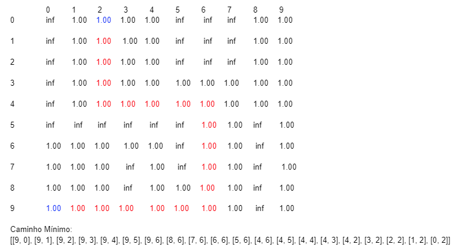
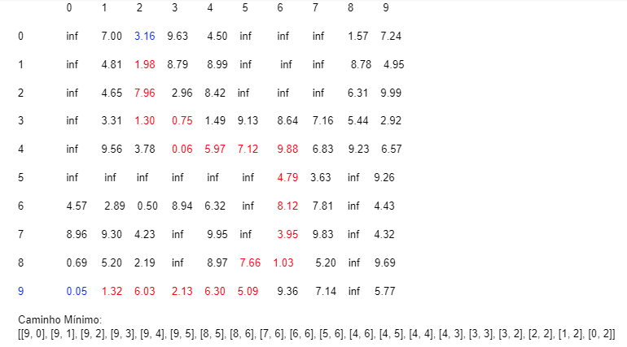
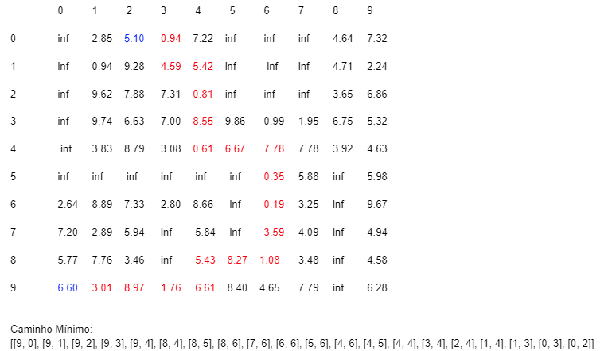

# GRAFOS: Atividade 1
# Problema: ----------------------------------------------------------------
# Aplicação básica
 Um robô precisa planejar a menor rota em uma grade de ocupação. Suponha que a grade de ocupação é fornecida como uma matriz com células indicando espaço livre (1) e obstáculo (∞). No caso, para a grade de ocupação a seguir:

```
  occupancy = np.ones((10, 10))
  
  occupancy[0:5, 0] = np.inf
  
  occupancy[5, 0:5] = np.inf
  
  occupancy[5:8, 5] = np.inf
  
  occupancy[0:3, 5:8] = np.inf
  
  occupancy[7:9, 3] = np.inf
  
  occupancy[5:10, 8] = np.inf
  
  print(occupancy)
  
 ```
  
 Sabendo que o robô inicia em uma célula específica, e.g. pos = [9, 0], e deseja-se chegar em uma posição destino, e.g. pos_d = [0, 2]. O robô se move apenas na horizontal e vertical (não se move na diagonal). Espera-se de retorno uma lista com o caminho.
 
 ```
 robot_pos_c = [9, 0] # Robot current position
 
 robot_pos_d = [0, 2] # Robot desired position

  def robot_path(robot_pos, robot_pos_d, occupancy):

    path = []
  
    ***Insert code here***
  
    return path

path = robot_path(robot_pos_c, robot_pos_d) 
```
 

# Considerando terreno
  Agora vamos considerar que algumas células representam regiões com terreno de mais difícil acesso que outras (terreno íngreme, com maior atrito). Dessa vez as células da grade de ocupação terão um peso atribuído de maneira não uniforme.
  ```
  occupancy = 10 * np.random.rand(10, 10)
  occupancy[0:5, 0] = np.inf
  
  occupancy[5, 0:5] = np.inf
  
  occupancy[5:8, 5] = np.inf
  
  occupancy[0:3, 5:8] = np.inf
  
  occupancy[7:9, 3] = np.inf
  
  occupancy[5:10, 8] = np.inf
  
  print(occupancy)
  
  ```
  

Espera-se que o mesmo código de cima funcione com esse cenário.

```
path = robot_path(robot_pos_c, robot_pos_d, occupancy)
```
# Solução: ----------------------------------------------------------------

  A resolução é feita em 3 arquivos, o ***robot.py*** que responsável pela parte da resolução do problema, o ***Grafo.py*** que serve para criar No e Aresta(funções para gerenciamento um grafo) e o ***matriz.py*** responsável por criar matriz(funções para gerenciamento de uma matriz).
 
  Na ***primeira parte*** do problema e gerado o grafo através da matriz de ocupação, onde na função
  
 > criar_vertices(occupancy)
 
  Em ***robot.py*** e gerado um objeto do tipo grafo e é percorrido toda a matriz de ocupação criando nós de acordo com sua posição se é diferente de ***inf***, cada nó terá um identificação do tipo ***[linha,coluna]***, após criar o nós no grafo, criaremos as aresta pela função 
  
> criar_arestas(g,occupancy)

 Onde para cada nó presente no grafo vamos verificar se existe vizinhos do tipo ***[linha,coluna + 1]*** e ***[linha + 1,coluna]***, caso exista será criado uma aresta não orientada entre os vértice;

  Na ***segunda parte*** do problema teremos que busca o caminho mínimo entre dois nó, por meio da implementação do algoritmo de  ***Dijkstra***, que está dentro do arquivo ***grafo.py***
  
> Dijkstra(self,u)

  Onde para cada vértice ele salvará o vértice antecessor e o custo de chegar naquela nó de um nó inicial(informado no problema);
  
  Na ***terceira parte*** do problema vamos salvar a lista do caminho mínimo, assim na função
  
> caminho_minimo(self,u,v)
 
  Onde ***u*** será o início e ***v*** o fim, ele pega o vértice ***v*** verificar seu ***antecessor***, que foi gerado na função ***Dijkstra()***, irá salva ele na lista do caminho mínimo, faz ***v*** ser igual ao antecessor e repete o todo processo até que ***v*** seja igual a ***u***,. após isso invertemos a lista e teremos o caminho mínimo de ***u*** a ***v***.

## Entrada: 
  Matriz[10][10], posição inicial [9,0], posição final [0,2]
## Saída:
  Caminho minímo[]
## Exemplo de execução:
### Caso 1: Terreno uniforme (1's)

### Caso 2: Terreno não uniforme (Float)

### Caso 3: Terreno não uniforme (Float)

